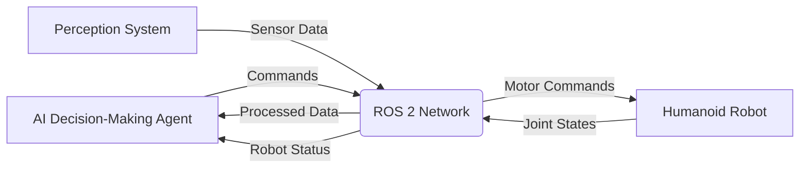

# Introduction to ROS 2 and Robot Middleware

## What is ROS 2?

ROS 2 (Robot Operating System 2) is not an operating system in the traditional sense, but rather a flexible framework for writing robot software. It is a collection of tools, libraries, and conventions that aim to simplify the task of creating complex and robust robot behavior across a wide variety of robot platforms, hardware configurations, and applications.

ROS 2 is the next generation of the Robot Operating System, designed to address the limitations of ROS 1 and provide a more robust, scalable, and production-ready platform for robotics development.

## Why ROS 2 Matters for Physical AI

Physical AI involves AI systems that operate in the physical world, controlling and interacting with real-world objects and environments. ROS 2 serves as the critical middleware that enables these AI agents to communicate effectively with physical robotic systems.

### Key Benefits for Physical AI:

- **Distributed Architecture**: AI algorithms can run on different machines than the robots they control
- **Hardware Abstraction**: AI agents can work with various robot platforms without modification
- **Communication Layer**: Enables seamless interaction between perception, decision-making, and actuation systems
- **Real-time Capabilities**: Supports time-sensitive operations required for physical interaction

## ROS 2 Architecture and DDS-based Communication

ROS 2 uses a distributed architecture based on the Data Distribution Service (DDS) standard. DDS is a middleware protocol and API standard for data-centric connectivity, enabling scalable, real-time, dependable, available, and distributable data exchanges.

### Core Architecture Components:

- **Nodes**: Independent processes that perform computation
- **DDS Implementation**: Provides the underlying communication layer
- **RMW (ROS Middleware)**: Abstraction layer that allows switching between different DDS implementations
- **Topics**: Communication channels for publishing/subscribing to data streams
- **Services**: Request/response communication patterns
- **Actions**: Goal-oriented communication with feedback and status

### DDS Features:

- **Discovery**: Automatic discovery of nodes and their interfaces
- **Quality of Service (QoS)**: Configurable policies for reliability, durability, and performance
- **Data-Centricity**: Focus on data rather than endpoints
- **Platform Independence**: Works across different operating systems and hardware

## The Role of Middleware in Humanoid Robot Control

Middleware in robotics, particularly ROS 2, serves as the "nervous system" of humanoid robots by providing:

### Communication Infrastructure
- **Inter-Process Communication**: Enables different software components to communicate seamlessly
- **Real-time Data Exchange**: Critical for responsive humanoid robot behavior
- **Multi-Platform Integration**: Connects different systems and hardware components

### Control Architecture
- **Decoupled Components**: Allows independent development and testing of robot subsystems
- **Scalability**: Supports adding new sensors, actuators, and algorithms without system redesign
- **Modularity**: Enables reuse of components across different robot platforms

### Integration with AI Systems
- **Sensor Data Processing**: Provides AI systems with real-time sensor information
- **Command Execution**: Allows AI agents to send control commands to robot actuators
- **State Monitoring**: Enables AI systems to monitor robot state and adjust behavior

## Practical Example: AI Agent Controlling a Humanoid Robot

Let's consider a practical example of how ROS 2 enables an AI agent to control a humanoid robot:

In this example:
- The AI agent publishes motor commands to control the robot's movements
- The perception system publishes sensor data (camera, LIDAR, IMU) for the AI to process
- The humanoid robot publishes its current joint states and receives motor commands
- All communication happens through ROS 2 topics using the DDS middleware

## Summary

ROS 2 serves as the critical nervous system for humanoid robots, enabling the integration of AI agents with physical systems. Its DDS-based architecture provides the robust, scalable communication infrastructure necessary for complex robotic applications. Understanding ROS 2 is fundamental to developing AI systems that can effectively operate in the physical world.

## Next Steps

Continue to the next chapter to learn about [ROS 2 Communication Primitives](../ros2/communication), where you'll explore how different components communicate using Nodes, Topics, and Services.